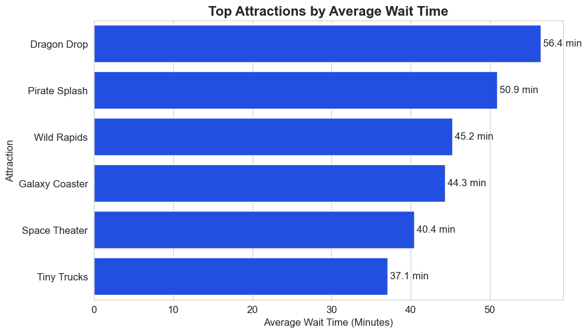
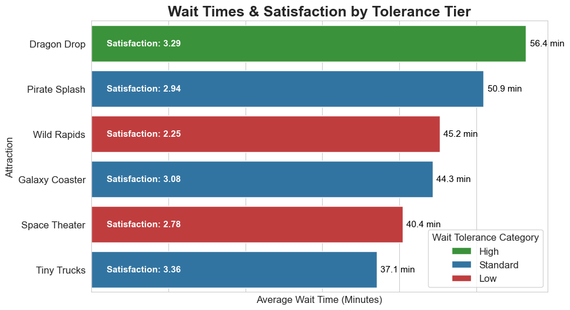
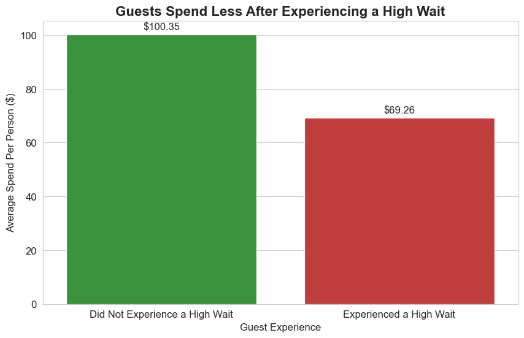

# Theme-Park-Analytics
# Supernova Theme Park: Operational Analysis & Recommendations
**Owner: Kabbo Sultan**

---

## Business Problem
Supernova Theme Park is facing volatile revenue and inconsistent guest satisfaction stemming from operational bottlenecks and a disconnect between marketing and high-value guest behavior. This project delivers a data-driven, cross-departmental plan. By analyzing the relationship between wait times, satisfaction, and in-park spending, we will provide a tiered operational strategy that optimizes queues for revenue and recommend targeted marketing actions to attract and retain the park's most profitable guest segments.

---

## Stakeholders
* **Primary Stakeholder — Park General Manager (GM):** Needs a clear, next-quarter playbook focused on high-wait attractions to improve satisfaction KPIs and stabilize revenue.
* **Supporting — Operations Director:** Needs ride-level demand curves and throughput insights to schedule staff, balance loads, and implement virtual queue pilots on the top three bottlenecks.
* **Supporting — Marketing Director:** Needs to coordinate messaging around operational changes and measure whether reduced waits increase spend-per-guest and intent to return.

---

## Overview of Database & Schema

This project utilizes a **star schema** database. In simple terms, this is a database structure where central "fact" tables, which contain quantitative data about events (like a park visit), are connected to surrounding "dimension" tables, which contain descriptive attributes (like guest demographics or attraction details). This design is highly efficient for analytical queries.

* The data is captured at multiple levels: one row per guest visit (`fact_visits`), one row per ride event (`fact_ride_events`), and one row per purchase (`fact_purchases`).
* Joins are primarily made using surrogate keys like `guest_id`, `attraction_id`, and `visit_id` to link the fact and dimension tables.

### Table Overview
* **Fact Tables:**
    * `fact_visits`: The central table, recording each guest's visit, party size, and total spend.
    * `fact_ride_events`: Records every instance a guest rides an attraction, including wait times and satisfaction.
    * `fact_purchases`: Details individual in-park purchases of items like food and merchandise.
* **Dimension Tables:**
    * `dim_guest`: Contains demographic information about each guest.
    * `dim_attraction`: Describes each attraction, including its name and category.
    * `dim_ticket`: Details the different ticket types available.
    * `dim_date`: Provides date-related attributes like day of the week and season.

---

## EDA (SQL)
Exploratory Data Analysis was performed to understand the initial state of the park's operations and guest behavior. Three key areas were investigated:

1.  **Wait Time Distribution:** We analyzed the range of wait times across all rides to confirm the business problem. We found a wide distribution, with some attractions having average waits exceeding 50 minutes, confirming the existence of significant bottlenecks.
2.  **Satisfaction by Attraction:** We correlated satisfaction ratings with specific attractions to see how operational performance impacts guest experience. The analysis revealed a clear trend that longer wait times are generally associated with lower satisfaction scores. For instance, Wild Rapids had one of the longest average waits and the lowest average satisfaction rating. However, the correlation is not perfect; Dragon Drop had the longest average wait but maintained a higher satisfaction score than several rides with shorter waits, suggesting that the thrill of a ride can partially offset a long queue.
3.  **Peak Attendance Days:** We analyzed daily visit counts to identify patterns. The data revealed that the busiest period is the entire week surrounding the July 4th holiday, with notable peaks on Wednesday, July 2nd (8 visits) and Monday, July 7th (10 visits). This highlights that operational planning must cover the full week, not just the holiday weekend.

For the complete exploratory analysis, see the query file: [/sql/01_eda.sql](sql/01_eda.sql).

---

## Data Cleaning & Feature Engineering (SQL)
To prepare the data for analysis, several cleaning and feature engineering steps were taken.

### Data Cleaning
The raw data contained significant inconsistencies. Key cleaning steps included:
* Parsing and converting monetary text fields (`total_spend_cents`) into clean integer columns (`spend_cents_clean`).
* Standardizing inconsistent attraction names (e.g., 'Galaxy coaster', 'Galaxy Coaster') and state abbreviations (e.g., 'CA', 'CALIFORNIA').
* **Merging Duplicate IDs:** After standardizing names, we found that a single attraction like 'Pirate Splash' existed under multiple `attraction_id`s. These were merged to ensure accurate grouping and analysis.

For the complete cleaning process, see the query file: [/sql/02_cleaning.sql](sql/02_cleaning.sql).

### Feature Engineering
New features were created to enable deeper analysis:
* `stay_minutes`: Calculated the total time a guest spent in the park. Rationale: Longer stays can correlate with higher spending and satisfaction.
* `wait_bucket`: Categorized wait times into buckets (e.g., '0-15 min', '30-60 min'). Rationale: Simplifies analysis of how different wait-length thresholds impact guest behavior.
* `spend_per_person`: Normalized total visit spend by party size. Rationale: Provides a clearer view of individual guest value.
* `high_wait_flag`: A flag set to `1` if a guest experienced a wait of over 30 minutes on a bottleneck ride. Rationale: Helps identify the specific guest cohort most affected by operational issues.

* ` wait_tolerance`: Categorize attractions by how well they handle long waits.

For the complete feature engineering script, see the query file: [/sql/03_features.sql](sql/03_features.sql).

---

## CTEs & Window Functions (SQL)
Advanced SQL queries using Common Table Expressions (CTEs) and window functions were used to uncover complex guest behaviors.

1.  **RFM & CLV Analysis:** We used `DENSE_RANK()` to rank our most valuable guests within their home state, allowing for geographically targeted marketing.
    ```sql
    SELECT
      guest_id,
      home_state,
      monetary_clv_proxy,
      DENSE_RANK() OVER (PARTITION BY home_state ORDER BY monetary_clv_proxy DESC) AS clv_rank_in_state
    FROM guest_rfm
    ```
2.  **Behavior Change Analysis:** We used `LAG()` to compare a guest's spending on their current visit to their previous one, revealing that guests increase their spending on roughly 35% of return visits.
    ```sql
    SELECT
      spend_cents_clean,
      LAG(spend_cents_clean, 1, 0) OVER (PARTITION BY guest_id ORDER BY d.date_iso) AS previous_spend_cents
    FROM fact_visits v
    ```

For the complete set of advanced queries, see the query file: [/sql/04_ctes_windows.sql](sql/04_ctes_windows.sql).

---

## Visuals (Python)


*Figure 1: Top Attractions by Average Wait Time.* This chart clearly identifies the top three operational bottlenecks requiring immediate attention: Dragon Drop, Pirate Splash, and Wild Rapids.


*Figure 2: Attraction Performance by Wait Tolerance.* This visual provides the core strategic insight, color-coding rides by their ability to handle long waits. It clearly shows which high-wait rides are urgent "Low Tolerance" fixes (red) versus "High Tolerance" thrill rides (green).


*Figure 3: Financial Impact of a High-Wait Experience.* This chart makes the business case for action, showing that guests who experience a long wait on a bottleneck ride spend over 30% less per person, quantifying the direct financial cost of operational friction.

---

## Insights & Recommendations

### For the Park General Manager (GM)
* **Insight:** The park's primary operational issue is concentrated on three bottleneck attractions that directly harm guest satisfaction and suppress potential revenue.
* **Recommendation:** **Prioritize capital and operational budget for Q4 on fixing the top 3 bottleneck rides.** Frame this as a direct investment in improving the park's core KPIs: guest satisfaction and per-capita spending.

### For the Operations Director
* **Insight:** Guest "wait tolerance" varies by attraction. High-thrill rides like Dragon Drop can sustain longer waits without a severe drop in satisfaction, while other attractions like Wild Rapids see satisfaction plummet with shorter waits. Furthermore, the highest-spending guests are those who experience moderate, not minimal, wait times (the "engagement sweet spot").

* **Recommendations:** 

  * **Implement a Tiered Intervention Strategy**:

    1. **Priority 1 (Urgent Fix - Low Wait Tolerance):** Immediately target rides with both long waits and low satisfaction, like Wild Rapids and Pirate Splash. These are actively harming the guest experience. Pilot a virtual queue system here first to reduce physical line time and frustration.

    2. **Priority 2 (Experience Enhancement - High Wait Tolerance):** For high-thrill, high-satisfaction rides like Dragon Drop, the long wait is less damaging but still an opportunity. Introduce a virtual queue here as a premium feature to enhance the experience, rather than as an urgent fix.

  * **Optimize for the "Sweet Spot":** The operational goal should not be to eliminate all waits, but to keep the majority of attraction queues below the 30-minute frustration threshold. This prevents the significant drop-off in guest spending associated with long waits and keeps guests in the high-value "engagement sweet spot."

  * **Reallocate Staff Dynamically:** Use the high_wait_flag feature in conjunction with time-of-day data to identify the precise hours when bottlenecks form. Reallocate staff to increase ride throughput only during these critical windows, optimizing labor costs.


### For the Marketing Director
* **Insight:** The in-park experience, particularly wait times, directly influences guest spending. A frustrating wait is a direct barrier to revenue. But there is a "wait tolerence" of 30 minutes which results in maximum spending. This create new marketing opportunities.
* **Recommendations:**
    1.  **Market the Fixes, Not the Problems:** Heavily promote the new "Virtual Queue" system on Space Theater and Wild Rapids, which have a low wait tolerence. Frame it as a premium benefit that gives guests more freedom to enjoy the park, turning an operational improvement into a marketing win.
    2.  **Create a "Thrill Seeker's Pass:** For rides with high wait tolerance like Dragon Drop, bundle a one-time virtual queue reservation with a food or merchandise voucher. This targets guests who are already willing to wait and encourages them to spend more.
    3.  **Launch a Data-Driven Service Recovery Program:** Use the high_wait_flag to identify guests who experienced a long wait. Instead of a generic apology, send a targeted offer: "We know waits can be long for popular rides. Here’s a complimentary virtual queue spot for your next visit to Dragon Drop on us!"

---

## Ethics & Bias
* **Data Quality:** The initial dataset contained significant inconsistencies in categorical data (attraction names, states), which could have biased the analysis. All cleaning decisions are documented in `/sql/02_cleaning.sql`.
* **Missing Values:** A portion of ride events were missing `wait_minutes` or `satisfaction_rating`. These were excluded from relevant calculations, which means our averages are based only on recorded data and may not capture the full picture.
* **Time Window:** This analysis is based on a short period in July 2025. The findings are highly relevant for summer operations but may not represent guest behavior during other seasons.
* **Margin Not Modeled:** The analysis focuses on revenue (`spend_cents_clean`). It does not account for the profit margin on different items, which is a limitation when assessing true monetary value.

---

## Repo Navigation
* **/sql:** Contains all SQL scripts for EDA, cleaning, feature engineering, and analysis.
* **/notebooks:** Contains the Python notebook (`visual_analysis.ipynb`) used to generate the visuals.
* **/figures:** Contains the three final PNG image files for the visuals.
* **/data:** Contains the source `themepark.db` database file.
